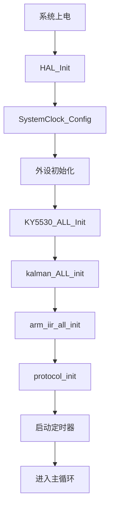
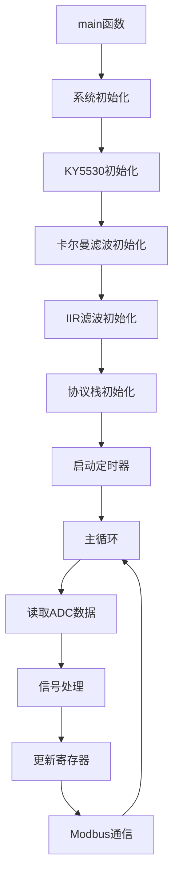

# STM32F407重量测量与PLC通信系统

## 项目概述

本项目是一个基于STM32F407微控制器的工业重量测量系统，使用KY5530高精度ADC芯片读取6路重量传感器数据，通过多级滤波算法处理信号，并采用Modbus RTU协议与PLC进行通信。

## 系统架构

### 硬件平台
- **主控芯片**: STM32F407VET6 (180MHz)
- **ADC芯片**: KY5530 (6通道24位高精度ADC)
- **通信接口**: RS485 (Modbus RTU协议)
- **调试接口**: UART1 (上位机通信)

### 软件架构
```
┌─────────────────┐    ┌─────────────────┐    ┌─────────────────┐
│   数据采集层    │    │   信号处理层    │    │   通信协议层    │
│                │    │                │    │                │
│  KY5530 ADC    │───?│  卡尔曼滤波    │───?│   Modbus RTU   │
│  6通道采集     │    │  IIR滤波       │    │   RS485通信    │
│  SPI接口       │    │  均值滤波      │    │   寄存器映射    │
└─────────────────┘    └─────────────────┘    └─────────────────┘
```

## 代码流程框架

### 1. 系统初始化流程



### 2. 主程序执行流程



## 核心函数调用关系

### 1. 初始化函数调用链

```c
main()
├── HAL_Init()
├── SystemClock_Config()
├── MX_GPIO_Init()
├── MX_USART1_UART_Init()
├── MX_USART2_UART_Init()
├── MX_USART3_UART_Init()
├── MX_TIM13_Init()
├── MX_TIM14_Init()
├── MX_TIM11_Init()
├── MX_TIM10_Init()
├── MX_TIM7_Init()
├── KY5530_ALL_Init()
│   ├── KY5532_Init() (6次调用，对应6个通道)
│   └── KY5532_ch0_continue_start()
├── kalman_ALL_init()
│   └── kalman_init() (6次调用，对应6个通道)
├── arm_iir_all_init()
└── protocol_init()
```

### 2. 数据采集与处理调用链

```c
TIM10中断 (1500Hz)
├── control_ky5532_readADC()
│   └── KY5532_read_adcVal()
├── kalman_filter()
├── arm_biquad_cascade_df1_f32()
└── HAL_GPIO_TogglePin()

TIM11中断 (100Hz)
├── 累加ADC数据
└── 计算平均值

TIM7中断 (3Hz)
├── modbus_service()
└── printf() (调试输出)

TIM14中断 (10Hz)
├── 动态/稳态检测
├── 超量程检测
├── 去皮操作
└── 标定操作
```

### 3. Modbus通信调用链

```c
modbus_service()
├── CRC16() (校验)
├── modbus_03_function() (读寄存器)
├── modbus_06_function() (写单寄存器)
└── modbus_16_function() (写多寄存器)
```

## 关键数据结构

### 1. 卡尔曼滤波器结构体
```c
typedef struct {
    float32_t x;    // 状态估计值
    float A;        // 状态转移矩阵
    float H;        // 测量矩阵
    float q;        // 过程噪声协方差
    float r;        // 测量噪声协方差
    float p;        // 估计误差协方差
    float gain;     // 卡尔曼增益
} kalman_struct;
```

### 2. 系统全局变量
```c
// 6通道ADC原始值
int32_t ky1_value, ky2_value, ky3_value, ky4_value, ky5_value, ky6_value;

// 6通道卡尔曼滤波器实例
kalman_struct KY1_Kalman, KY2_Kalman, KY3_Kalman, KY4_Kalman, KY5_Kalman, KY6_Kalman;

// 6通道平均值
float32_t KY1_ave, KY2_ave, KY3_ave, KY4_ave, KY5_ave, KY6_ave;

// 6通道最终重量值
float32_t KY1_printf, KY2_printf, KY3_printf, KY4_printf, KY5_printf, KY6_printf;

// Modbus虚拟寄存器
uint16_t modbus_virtual_register[550];
```

## 定时器配置

| 定时器 | 频率 | 用途 | 中断优先级 |
|--------|------|------|------------|
| TIM10  | 1500Hz | 主要数据采集 | 1 |
| TIM11  | 100Hz  | 均值计算 | 2 |
| TIM7   | 3Hz    | 调试输出 | 2 |
| TIM14  | 10Hz   | 状态检测 | 0 |
| TIM13  | 10kHz  | Modbus超时 | 3 |

## 信号处理算法

### 1. 多级滤波架构
```
原始ADC值 → 卡尔曼滤波 → IIR滤波 → 滑动窗口均值滤波 → 最终重量值
```

### 2. 滤波参数配置
```c
// 根据采样频率调整参数
switch(lvbocanshu) {
    case 1: // 25Hz
        KY1_Kalman.q = 0.5f;
        KY1_Kalman.r = 30.0f;
        break;
    case 2: // 50Hz
        KY1_Kalman.q = 0.8f;
        KY1_Kalman.r = 38.0f;
        break;
    case 3: // 100Hz
        KY1_Kalman.q = 0.2f;
        KY1_Kalman.r = 50.0f;
        break;
    case 4: // 1500Hz
        KY1_Kalman.q = 0.001f;
        KY1_Kalman.r = 2000.0f;
        break;
}
```

## Modbus寄存器映射

### 重量数据寄存器 (0-55)
- **0-7**: 通道1重量值 (32位，分高低16位)
- **8-15**: 通道1状态和警告信息
- **16-23**: 通道2重量值和状态
- **24-31**: 通道3重量值和状态
- **32-39**: 通道4重量值和状态
- **40-47**: 通道5重量值和状态
- **48-55**: 通道6重量值和状态

### 控制寄存器 (510-542)
- **510-533**: 各通道清零、去皮、标定控制
- **536**: 稳定范围参数
- **537**: 稳定时间参数
- **538**: 动态范围参数
- **539**: 动态时间参数
- **540**: RS485波特率设置
- **541**: RS485数据格式设置
- **542**: RS485从站地址设置

## 编译和烧录

### 开发环境
- **IDE**: Keil MDK-ARM 5.x
- **编译器**: ARM Compiler 6.x
- **调试器**: J-Link / ST-Link

### 编译步骤
1. 打开项目文件 `MDK-ARM/weigh.uvprojx`
2. 选择目标芯片 STM32F407VET6
3. 编译项目 (F7)
4. 下载到目标板

### 调试配置
- 使用J-Link调试器
- 配置调试参数在 `DebugConfig/` 目录下

## 系统特性

### 1. 高精度测量
- 24位ADC分辨率
- 多级滤波算法
- 实时噪声抑制

### 2. 实时性能
- 1500Hz采样频率
- 中断驱动架构
- 低延迟响应

### 3. 工业标准
- Modbus RTU协议
- RS485通信接口
- 标准寄存器映射

### 4. 可靠性
- 超量程保护
- 通信超时检测
- 看门狗机制

## 使用说明

### 1. 系统启动
1. 上电后系统自动初始化
2. 6个KY5530通道开始连续转换
3. 卡尔曼滤波器开始工作
4. Modbus通信准备就绪

### 2. 重量测量
- 系统自动读取6路重量传感器
- 实时滤波处理
- 结果存储在Modbus寄存器中

### 3. PLC通信
- PLC通过Modbus协议读取重量数据
- 支持功能码03(读)、06(写单)、16(写多)
- 通信波特率可配置

### 4. 调试功能
- UART1输出调试信息
- 支持实时数据监控
- 可配置调试输出频率

## 故障排除

### 1. 常见问题
- **ADC读取失败**: 检查KY5530连接和SPI通信
- **Modbus通信异常**: 检查RS485接线和波特率设置
- **滤波效果不佳**: 调整卡尔曼滤波参数

### 2. 调试方法
- 使用串口调试助手监控UART1输出
- 检查定时器中断是否正常触发
- 验证Modbus寄存器数据更新

## 版本历史

- **V1.0**: 基础功能实现
- **V1.1**: 增加多级滤波
- **V1.2**: 优化卡尔曼滤波参数
- **V1.3**: 完善Modbus协议支持

## 技术支持

如有技术问题，请联系开发团队或查看相关技术文档。

---

**注意**: 本系统为工业级应用，请确保在安全环境下使用，并遵循相关安全规范。
